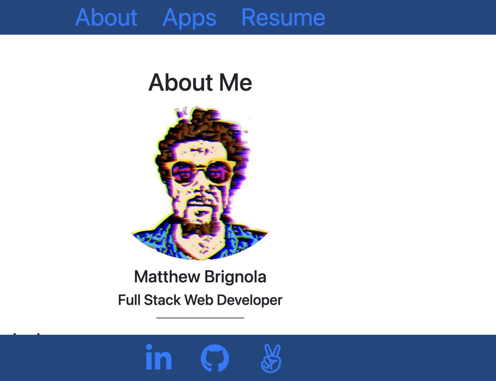
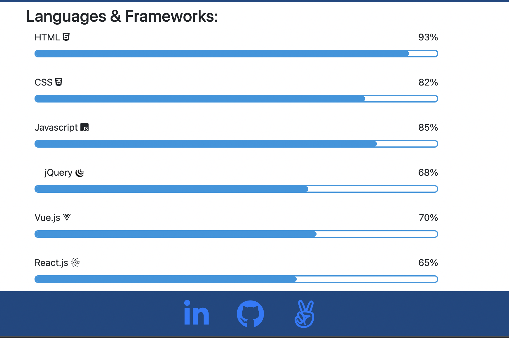
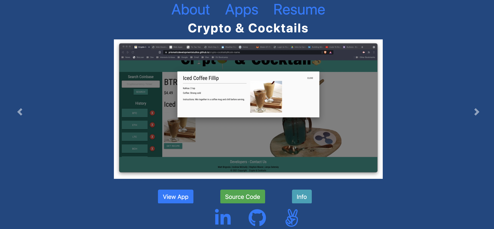
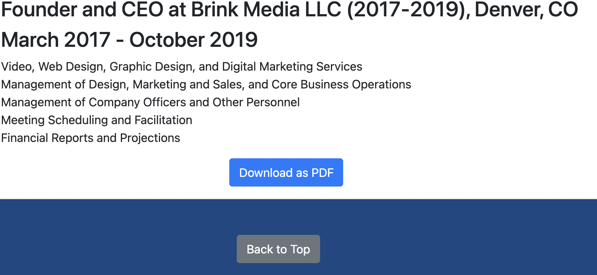

# Brignola-Portfolio

## Descripton
This repository contains the code for a deployed web app that is my web developmen porfolio. This app includes 6 of my deployed applications, which are displayed with a Bootstrap carousel component.

## Table of Contents
* [Contact](#contact)
* [Technologies](#technologies)  
* [Instructions](#instructions)

## Contact
(719) 351-5828 
matthewbrignola@ymail.com 
https://www.linkedin.com/in/matthewbrignola/
## Technologies
  HTML
   CSS
   JavaScript
   [jQuery](https://jquery.com/)
    [jQuery UI](https://jqueryui.com/)
     [Bootstrap](https://getbootstrap.com/) 
## Instructions
1. Scroll through he "About Me" section to get an overview of myself, my contact information, and my web development skills. 

2. Included is a list of my proficiencies in web developmen languages and frameworks.  

3. Croll down to see a carousel that displays some of my deployed web applications. 
 
4. At the bottom of my resume is a button to download a PDF version of my resume. 
 

